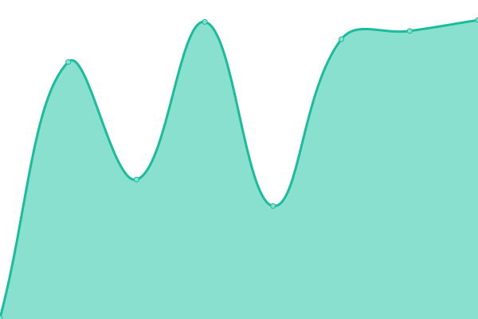

# [📈 Live Status](https://upptime.tjsky.net/): <!--live status--> **🟧 部分停机**

This repository contains the open-source uptime monitor and status page for [去年夏天](https://www.tjsky.net), powered by [Upptime](https://github.com/upptime/upptime).

<!-- With [Upptime](https://upptime.js.org), you can get your own unlimited and free uptime monitor and status page, powered entirely by a GitHub repository. We use [Issues](https://github.com/tjsky/upptime/issues) as incident reports, [Actions](https://github.com/tjsky/upptime/actions) as uptime monitors, and [Pages](https://demo.upptime.js.org) for the status page. -->

<!--start: status pages-->
<!-- This summary is generated by Upptime (https://github.com/upptime/upptime) -->
<!-- Do not edit this manually, your changes will be overwritten -->
<!-- prettier-ignore -->
| 链接 | 状态 | 历史 | 响应时间 | 正常运行时间 |
| --- | ------ | ------- | ------------- | ------ |
|  [反代1（diii.tk）](https://diii.tk/https://1.1.1.1/cdn-cgi/trace) | 🟩 正常运行 | [1-diii-tk.yml](https://github.com/tjsky/upptime/commits/HEAD/history/1-diii-tk.yml) | 

 349毫秒
     
 | 

<a href="https://upptime.tjsky.net/history/1-diii-tk">100.00%</a>
    

|  [反代2（tjsky.cf）](https://api-pikpak.tjsky.cf/https://1.1.1.1/cdn-cgi/trace) | 🟩 正常运行 | [2-tjsky-cf.yml](https://github.com/tjsky/upptime/commits/HEAD/history/2-tjsky-cf.yml) | 

 340毫秒
     
 | 

<a href="https://upptime.tjsky.net/history/2-tjsky-cf">97.60%</a>
    

|  [反代3（tjsky-1.cf）](https://api-pikpak.tjsky-1.cf/https://1.1.1.1/cdn-cgi/trace) | 🟩 正常运行 | [3-tjsky-1-cf.yml](https://github.com/tjsky/upptime/commits/HEAD/history/3-tjsky-1-cf.yml) | 

 345毫秒
     
 | 

<a href="https://upptime.tjsky.net/history/3-tjsky-1-cf">100.00%</a>
    

|  [反代6（yooyi.tk）](https://pan.yooyi.tk/https://1.1.1.1/cdn-cgi/trace) | 🟩 正常运行 | [6-yooyi-tk.yml](https://github.com/tjsky/upptime/commits/HEAD/history/6-yooyi-tk.yml) | 

 339毫秒
     
 | 

<a href="https://upptime.tjsky.net/history/6-yooyi-tk">97.98%</a>
    

|  [反代9（pikpakz.top）](https://pk.pikpakz.top/https://1.1.1.1/cdn-cgi/trace) | 🟩 正常运行 | [9-pikpakz-top.yml](https://github.com/tjsky/upptime/commits/HEAD/history/9-pikpakz-top.yml) | 

 348毫秒
     
 | 

<a href="https://upptime.tjsky.net/history/9-pikpakz-top">100.00%</a>
    

|  [反代10（123.cf）](https://cc123.cf/https://1.1.1.1/cdn-cgi/trace) | 🟩 正常运行 | [10-123-cf.yml](https://github.com/tjsky/upptime/commits/HEAD/history/10-123-cf.yml) | 

 347毫秒
     
 | 

<a href="https://upptime.tjsky.net/history/10-123-cf">100.00%</a>
    

|  [反代11（xswd.cf）](https://cf-api.xswd.cf/https://1.1.1.1/cdn-cgi/trace) | 🟩 正常运行 | [11-xswd-cf.yml](https://github.com/tjsky/upptime/commits/HEAD/history/11-xswd-cf.yml) | 

 350毫秒
     
 | 

<a href="https://upptime.tjsky.net/history/11-xswd-cf">100.00%</a>
    

|  [反代12（self.xyz）](https://pikpak.arielherself.xyz/https://1.1.1.1/cdn-cgi/trace) | 🟩 正常运行 | [12-self-xyz.yml](https://github.com/tjsky/upptime/commits/HEAD/history/12-self-xyz.yml) | 

 107毫秒
     
 | 

<a href="https://upptime.tjsky.net/history/12-self-xyz">98.30%</a>
    

|  [反代13（nxcloud.uk）](https://f.nxcloud.uk/https://1.1.1.1/cdn-cgi/trace) | 🟩 正常运行 | [13-nxcloud-uk.yml](https://github.com/tjsky/upptime/commits/HEAD/history/13-nxcloud-uk.yml) | 

 189毫秒
     
 | 

<a href="https://upptime.tjsky.net/history/13-nxcloud-uk">100.00%</a>
    

|  [反代14（tstream.net）](https://wkr.btstream.net/https://1.1.1.1/cdn-cgi/trace) | 🟩 正常运行 | [14-tstream-net.yml](https://github.com/tjsky/upptime/commits/HEAD/history/14-tstream-net.yml) | 

 139毫秒
     
 | 

<a href="https://upptime.tjsky.net/history/14-tstream-net">100.00%</a>
    

|  [反代15（mant.me）](https://dns.firmant.me/https://1.1.1.1/cdn-cgi/trace) | 🟩 正常运行 | [15-mant-me.yml](https://github.com/tjsky/upptime/commits/HEAD/history/15-mant-me.yml) | 

 200毫秒
     
 | 

<a href="https://upptime.tjsky.net/history/15-mant-me">100.00%</a>
    

|  [反代16（obiz.cn）](https://p.emobiz.cn/https://1.1.1.1/cdn-cgi/trace) | 🟩 正常运行 | [16-obiz-cn.yml](https://github.com/tjsky/upptime/commits/HEAD/history/16-obiz-cn.yml) | 

 378毫秒
     
 | 

<a href="https://upptime.tjsky.net/history/16-obiz-cn">100.00%</a>
    

|  [反代17（-s.online）](https://pikpak.yang-s.online/https://1.1.1.1/cdn-cgi/trace) | 🟩 正常运行 | [17-s-online.yml](https://github.com/tjsky/upptime/commits/HEAD/history/17-s-online.yml) | 

 165毫秒
     
 | 

<a href="https://upptime.tjsky.net/history/17-s-online">100.00%</a>
    

|  [反代18（low.ga）](https://pikpak.hongtonlow.ga/https://1.1.1.1/cdn-cgi/trace) | 🟩 正常运行 | [18-low-ga.yml](https://github.com/tjsky/upptime/commits/HEAD/history/18-low-ga.yml) | 

 1001毫秒
     
 | 

<a href="https://upptime.tjsky.net/history/18-low-ga">100.00%</a>
    

|  [反代19（936.xyz）](https://pikpak.520936.xyz/https://1.1.1.1/cdn-cgi/trace) | 🟩 正常运行 | [19-936-xyz.yml](https://github.com/tjsky/upptime/commits/HEAD/history/19-936-xyz.yml) | 

 150毫秒
     
 | 

<a href="https://upptime.tjsky.net/history/19-936-xyz">100.00%</a>
    

|  SITE_MAIN | 🟥 停机 | [site-main.yml](https://github.com/tjsky/upptime/commits/HEAD/history/site-main.yml) | 

 1183毫秒
     
 | 

<a href="https://upptime.tjsky.net/history/site-main">99.52%</a>
    

|  SITE_PIC | 🟥 停机 | [site-pic.yml](https://github.com/tjsky/upptime/commits/HEAD/history/site-pic.yml) | 

 664毫秒
     
 | 

<a href="https://upptime.tjsky.net/history/site-pic">99.53%</a>
    

|  SITE_RSS | 🟥 停机 | [site-rss.yml](https://github.com/tjsky/upptime/commits/HEAD/history/site-rss.yml) | 

 667毫秒
     
 | 

<a href="https://upptime.tjsky.net/history/site-rss">99.54%</a>
    

|  SITE_MS | 🟩 正常运行 | [site-ms.yml](https://github.com/tjsky/upptime/commits/HEAD/history/site-ms.yml) | 

 1187毫秒
     
 | 

<a href="https://upptime.tjsky.net/history/site-ms">99.55%</a>
    

|  SITE_READ | 🟩 正常运行 | [site-read.yml](https://github.com/tjsky/upptime/commits/HEAD/history/site-read.yml) | 

 998毫秒
     
 | 

<a href="https://upptime.tjsky.net/history/site-read">99.56%</a>
    

|  SITE_SCREENS | 🟩 正常运行 | [site-screens.yml](https://github.com/tjsky/upptime/commits/HEAD/history/site-screens.yml) | 

 824毫秒
     
 | 

<a href="https://upptime.tjsky.net/history/site-screens">99.57%</a>
    

|  SITE_TOK | 🟩 正常运行 | [site-tok.yml](https://github.com/tjsky/upptime/commits/HEAD/history/site-tok.yml) | 

 771毫秒
     
 | 

<a href="https://upptime.tjsky.net/history/site-tok">99.58%</a>
    

|  SITE_CF | 🟩 正常运行 | [site-cf.yml](https://github.com/tjsky/upptime/commits/HEAD/history/site-cf.yml) | 

 337毫秒
     
 | 

<a href="https://upptime.tjsky.net/history/site-cf">100.00%</a>
    

<!--end: status pages-->

[**Visit our status website →**](https://upptime.tjsky.net)

## 📄 License

- Powered by: [Upptime](https://github.com/upptime/upptime)
- Code: [MIT](./LICENSE) © [去年夏天](https://www.tjsky.net)
- Data in the `./history` directory: [Open Database License](https://opendatacommons.org/licenses/odbl/1-0/)
