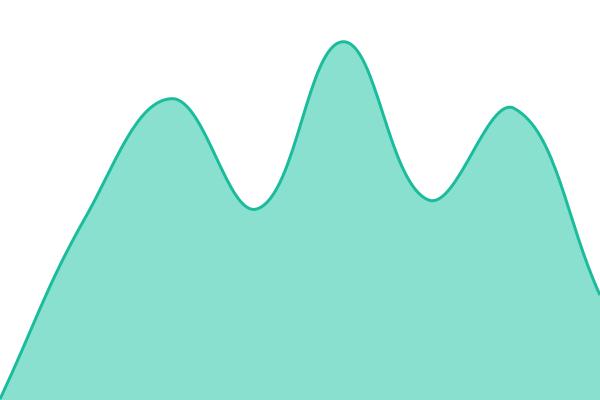

# [📈 Live Status](https://upptime.tjsky.net/): <!--live status--> **所有系统都可以正常运行**

This repository contains the open-source uptime monitor and status page for [去年夏天](https://www.tjsky.net), powered by [Upptime](https://github.com/upptime/upptime).

<!-- With [Upptime](https://upptime.js.org), you can get your own unlimited and free uptime monitor and status page, powered entirely by a GitHub repository. We use [Issues](https://github.com/tjsky/upptime/issues) as incident reports, [Actions](https://github.com/tjsky/upptime/actions) as uptime monitors, and [Pages](https://demo.upptime.js.org) for the status page. -->

<!--start: status pages-->
<!-- This summary is generated by Upptime (https://github.com/upptime/upptime) -->
<!-- Do not edit this manually, your changes will be overwritten -->
<!-- prettier-ignore -->
| 链接 | 状态 | 历史 | 响应时间 | 正常运行时间 |
| --- | ------ | ------- | ------------- | ------ |
|  [反代24（sky.top）](https://pikpak.tjsky.top/https://1.1.1.1/cdn-cgi/trace) | 🟩 正常运行 | [24-sky-top.yml](https://github.com/tjsky/upptime/commits/HEAD/history/24-sky-top.yml) | 

 279毫秒
     
 | 

<a href="https://upptime.tjsky.net/history/24-sky-top">100.00%</a>
    

|  [P-API-C](https://api-drive.mypikpak.com/drive/v1/files) | 🟩 正常运行 | [p-api-c.yml](https://github.com/tjsky/upptime/commits/HEAD/history/p-api-c.yml) | 

 922毫秒
     
 | 

<a href="https://upptime.tjsky.net/history/p-api-c">100.00%</a>
    

|  [P-API-N](https://api-drive.mypikpak.net/drive/v1/files) | 🟩 正常运行 | [p-api-n.yml](https://github.com/tjsky/upptime/commits/HEAD/history/p-api-n.yml) | 

 1063毫秒
     
 | 

<a href="https://upptime.tjsky.net/history/p-api-n">100.00%</a>
    

|  [P-C主页](https://mypikpak.com/) | 🟩 正常运行 | [p-c.yml](https://github.com/tjsky/upptime/commits/HEAD/history/p-c.yml) | 

 2664毫秒
     
 | 

<a href="https://upptime.tjsky.net/history/p-c">100.00%</a>
    

|  [P-N主页](https://mypikpak.net/) | 🟩 正常运行 | [p-n.yml](https://github.com/tjsky/upptime/commits/HEAD/history/p-n.yml) | 

 10653毫秒
     
 | 

<a href="https://upptime.tjsky.net/history/p-n">98.96%</a>
    

|  [下载0624](http://dl-a10b-0624.mypikpak.com) | 🟩 正常运行 | [0624.yml](https://github.com/tjsky/upptime/commits/HEAD/history/0624.yml) | 

 2090毫秒
     
 | 

<a href="https://upptime.tjsky.net/history/0624">100.00%</a>
    

|  SITE_MAIN | 🟩 正常运行 | [site-main.yml](https://github.com/tjsky/upptime/commits/HEAD/history/site-main.yml) | 

 882毫秒
     
 | 

<a href="https://upptime.tjsky.net/history/site-main">100.00%</a>
    

|  SITE_PIC | 🟩 正常运行 | [site-pic.yml](https://github.com/tjsky/upptime/commits/HEAD/history/site-pic.yml) | 

 681毫秒
     
 | 

<a href="https://upptime.tjsky.net/history/site-pic">100.00%</a>
    

|  SITE_RSS | 🟩 正常运行 | [site-rss.yml](https://github.com/tjsky/upptime/commits/HEAD/history/site-rss.yml) | 

 686毫秒
     
 | 

<a href="https://upptime.tjsky.net/history/site-rss">100.00%</a>
    

<!--end: status pages-->

[**Visit our status website →**](https://upptime.tjsky.net)

## 📄 License

- Powered by: [Upptime](https://github.com/upptime/upptime)
- Code: [MIT](./LICENSE) © [去年夏天](https://www.tjsky.net)
- Data in the `./history` directory: [Open Database License](https://opendatacommons.org/licenses/odbl/1-0/)
